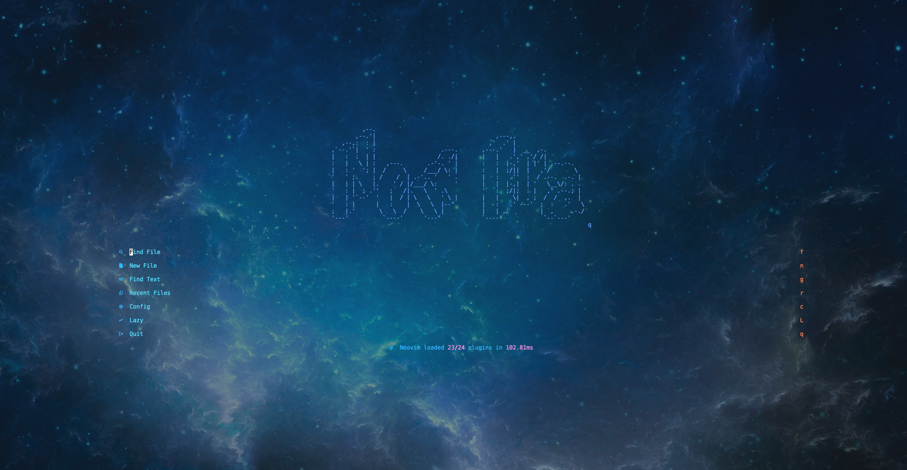
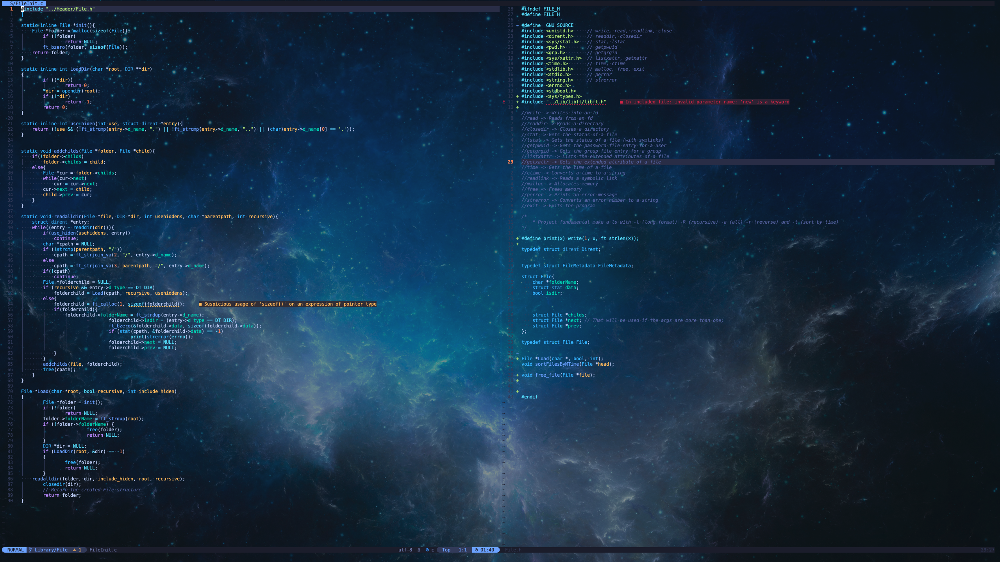
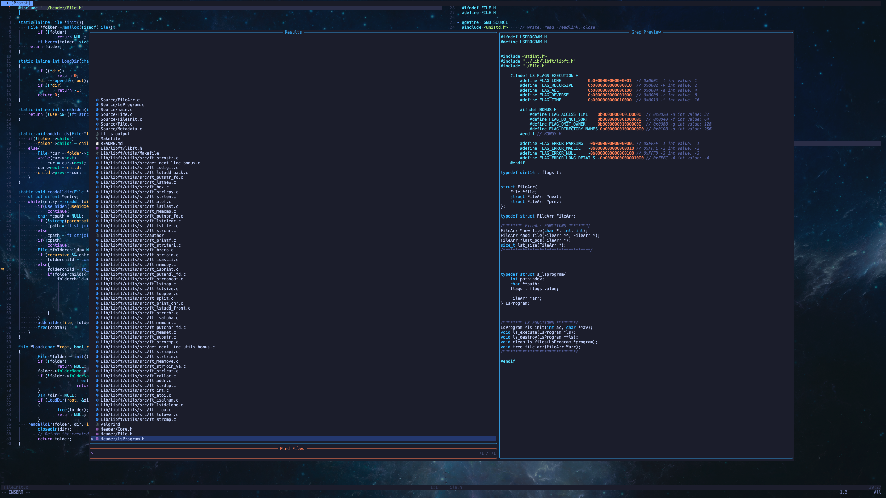

<table>
  <tr>
    <td style="padding: 5px; border: 1px solid #ddd;">
      
    </td>
    <td style="padding: 5px; border: 1px solid #ddd;">
      
    </td>
  </tr>
</table>

> If something goes wrong, create an issue and I will be right there to give you feedback and solve your problem.

---

## Installation

```bash
git clone https://github.com/PedroVMota/NewEraNeovim.git
cd NewEraNeovim
chmod +x install.sh
./install.sh
```

The installer will:
1. Detect your OS and package manager
2. Check for sudo access
3. Install dependencies (git, ripgrep, fd, node, cmake, etc.)
4. Download and install the **latest stable Neovim** from GitHub
5. Symlink this config to `~/.config/nvim` (with backup of existing config)

### WSL Users

Clipboard integration is automatic on WSL. Yanking (`y`, `yy`, `dd`, `x`, etc.) writes to the Windows clipboard via `clip.exe`, and pasting reads from it via `powershell.exe`. No extra tools required — it just works.

### Uninstall

```bash
chmod +x uninstall.sh
./uninstall.sh
```

Choose to remove everything, config only, or Neovim only. Restores backups if available.

---

## File Structure

```
NewEraNeovim/
  ├─ init.lua                     # Main entrypoint, settings, and lazy.nvim bootstrap
  ├─ install.sh                   # Automated Neovim installer
  ├─ uninstall.sh                 # Clean uninstaller
  ├─ lazy-lock.json               # Plugin version lockfile
  ├─ .github/
  │   └─ workflows/
  │       └─ version-tag.yml      # Auto semver tagging on PR merge
  └─ lua/
      ├─ lib/
      │   └─ init.lua             # Theme & environment customization library
      ├─ config/                  # Plugin-specific configuration
      │   ├─ init.lua
      │   ├─ cmp.lua
      │   ├─ harpoon.lua
      │   ├─ lualine.lua
      │   ├─ toggleterm.lua
      │   └─ whichkey.lua
      ├─ keymaps/                 # Keymap definitions
      │   ├─ init.lua
      │   ├─ general.lua
      │   ├─ harpoon.lua
      │   ├─ lsp.lua
      │   └─ mason.lua
      └─ plugins/                 # Plugin declarations (lazy.nvim specs)
          ├─ Autocomplete.lua     # nvim-cmp + LuaSnip
          ├─ Autoformater.lua     # conform.nvim (format on save)
          ├─ CodeUtility.lua      # surround, comments, autopairs
          ├─ FocusMode.lua        # zen-mode
          ├─ GitSigns.lua         # Git gutter signs
          ├─ Telescope.lua        # Fuzzy finder
          ├─ Treesitter.lua       # Syntax highlighting
          ├─ UIComponents.lua     # Theme (tokyonight), barbar, trouble
          ├─ gitutils.lua         # Git conflict resolution
          ├─ harpoon.lua          # File navigation marks
          ├─ lsp.lua              # LSP + Mason
          ├─ terminal.lua         # toggleterm
          ├─ theme-keymaps.lua    # Keymaps for the theme library
          ├─ trouble-nvim.lua     # Error lens
          └─ which-key.lua        # Keybinding hints popup
```

---

## Theme & Environment Library (`lua/lib`)

A built-in function library for customizing the visual environment at runtime. Use it in your config or call functions via keymaps.

```lua
local lib = require("lib")
```

| Module | Functions | Description |
|--------|-----------|-------------|
| `lib.theme` | `set(name)`, `get()`, `pick()` | Change colorscheme, interactive picker |
| `lib.transparency` | `enable()`, `disable()`, `toggle()`, `is_enabled()` | Transparent background |
| `lib.hl` | `set()`, `get()`, `set_fg()`, `set_bg()`, `italic_comments()`, `apply()` | Manipulate highlight groups |
| `lib.cursor` | `toggle_cursorline()`, `toggle_cursorcolumn()`, `set_style()` | Cursor appearance |
| `lib.numbers` | `toggle()`, `toggle_relative()`, `hybrid()`, `none()`, `toggle_signcolumn()` | Line numbers & gutter |
| `lib.statusline` | `hide()`, `global()`, `per_window()`, `toggle()` | Statusline visibility |
| `lib.visual` | `toggle_wrap()`, `toggle_listchars()`, `toggle_spell()`, `toggle_background()`, `set_colorcolumn()`, `toggle_colorcolumn()`, `set_scrolloff()`, `toggle_conceal()` | Visual options |
| `lib.font` | `set(name, size)`, `increase()`, `decrease()` | GUI font (Neovide, etc.) |

---

## Keybindings

### Toggle & Appearance (`<leader>t`)

All wired to the theme library and visible in **which-key**.

| Key | Action |
|-----|--------|
| `<leader>tac` | Colorscheme picker |
| `<leader>tab` | Toggle dark/light background |
| `<leader>tat` | Toggle transparency |
| `<leader>tai` | Italic comments on |
| `<leader>taI` | Italic comments off |
| `<leader>tl` | Toggle cursorline |
| `<leader>tC` | Toggle cursorcolumn |
| `<leader>tn` | Toggle line numbers |
| `<leader>tr` | Toggle relative numbers |
| `<leader>tg` | Toggle signcolumn |
| `<leader>ts` | Toggle statusline |
| `<leader>tw` | Toggle line wrap |
| `<leader>ti` | Toggle listchars |
| `<leader>tp` | Toggle spell check |
| `<leader>tc` | Toggle colorcolumn (80) |
| `<leader>te` | Toggle conceal level |

### General

| Key | Action |
|-----|--------|
| `<leader>\` | Vertical split |
| `<leader>-` | Horizontal split |
| `<C-h/j/k/l>` | Navigate between windows |
| `<Esc>` | Clear search highlight |
| `<leader>q` | Open diagnostic quickfix list |
| `<C-z>` | Zen mode |
| `<C-t>` | Toggle terminal |

### File Explorer (`<leader>sft`) — Neo-tree

| Key | Action |
|-----|--------|
| `<leader>sft` | Toggle file explorer tree |

**Inside the tree:**

| Key | Action |
|-----|--------|
| `a` | Create file (type name + Enter) |
| `A` | Create folder |
| `d` | Delete file/folder |
| `r` | Rename file/folder |
| `m` | Move to another path |
| `c` | Copy to another path |
| `y` | Yank (copy) to clipboard |
| `x` | Cut to clipboard |
| `p` | Paste from clipboard |
| `Enter` | Open file |
| `h/l` | Collapse/expand directory |

> The tree always follows the file currently open in the active buffer.

---

### Search (`<leader>s`) — Telescope

| Key | Action |
|-----|--------|
| `<leader>sf` | Find files |
| `<leader>sg` | Live grep |
| `<leader>sh` | Search help |
| `<leader>sk` | Search keymaps |
| `<leader>ss` | Search Telescope pickers |
| `<leader>sw` | Search word under cursor |
| `<leader>sd` | Search diagnostics |
| `<leader>sr` | Resume last search |
| `<leader>s.` | Recent files |
| `<leader>st` | Search TODOs |
| `<leader>/` | Fuzzy search in current buffer |
| `<leader>s/` | Live grep in open files |
| `<leader>sn` | Find Neovim config files |
| `<leader><leader>` | List open buffers |

### LSP

| Key | Action |
|-----|--------|
| `gd` | Go to definition |
| `gr` | Find references |
| `gI` | Go to implementation |
| `gD` | Go to declaration |
| `<leader>D` | Type definition |
| `<leader>ds` | Document symbols |
| `<leader>ws` | Workspace symbols |
| `<leader>rn` | Rename symbol |
| `<leader>ca` | Code action |
| `<leader>th` | Toggle inlay hints |
| `<leader>f` | Format buffer |

### Harpoon

| Key | Action |
|-----|--------|
| `<leader>H` | Add file to Harpoon |
| `<leader>h` | Harpoon quick menu |
| `<leader>Hd` | Remove current file from Harpoon |
| `<leader>1-5` | Jump to Harpoon file 1-5 |

### Mason

| Key | Action |
|-----|--------|
| `<leader>m` | Open Mason |

---

## Versioning

This project uses **automatic semantic versioning**. When a PR is merged to the `origin` branch, a GitHub Actions workflow creates a version tag based on:

| PR Label or Title Prefix | Bump |
|--------------------------|------|
| `major`, `breaking` | **Major** (v1.0.0 → v2.0.0) |
| `minor`, `feature`, `feat` | **Minor** (v1.0.0 → v1.1.0) |
| `patch`, `fix`, `chore`, `docs` | **Patch** (v1.0.0 → v1.0.1) |

Default bump (no label/prefix): **patch**.

---

## Plugins

| Plugin | Purpose |
|--------|---------|
| [tokyonight.nvim](https://github.com/folke/tokyonight.nvim) | Colorscheme |
| [nvim-treesitter](https://github.com/nvim-treesitter/nvim-treesitter) | Syntax highlighting |
| [nvim-lspconfig](https://github.com/neovim/nvim-lspconfig) | LSP configuration |
| [mason.nvim](https://github.com/williamboman/mason.nvim) | LSP/tool installer |
| [nvim-cmp](https://github.com/hrsh7th/nvim-cmp) | Autocompletion |
| [telescope.nvim](https://github.com/nvim-telescope/telescope.nvim) | Fuzzy finder |
| [harpoon](https://github.com/ThePrimeagen/harpoon) | File navigation |
| [gitsigns.nvim](https://github.com/lewis6991/gitsigns.nvim) | Git signs in gutter |
| [git-conflict.nvim](https://github.com/akinsho/git-conflict.nvim) | Git conflict resolution |
| [barbar.nvim](https://github.com/romgrk/barbar.nvim) | Buffer tabline |
| [conform.nvim](https://github.com/stevearc/conform.nvim) | Auto-formatting |
| [which-key.nvim](https://github.com/folke/which-key.nvim) | Keybinding hints |
| [zen-mode.nvim](https://github.com/folke/zen-mode.nvim) | Focus/distraction-free mode |
| [toggleterm.nvim](https://github.com/akinsho/toggleterm.nvim) | Terminal integration |
| [todo-comments.nvim](https://github.com/folke/todo-comments.nvim) | Highlight TODO/FIX/HACK comments |
| [trouble.nvim](https://github.com/folke/trouble.nvim) | Diagnostics list |
| [error-lens.nvim](https://github.com/chikko80/error-lens.nvim) | Inline error display |
| [mini.nvim](https://github.com/echasnovski/mini.nvim) | Surround, AI textobjects, statusline |
| [LuaSnip](https://github.com/L3MON4D3/LuaSnip) | Snippet engine |
| [nvim-surround](https://github.com/kylechui/nvim-surround) | Surround operations |
| [Comment.nvim](https://github.com/numToStr/Comment.nvim) | Code commenting |
| [nvim-autopairs](https://github.com/windwp/nvim-autopairs) | Auto-close brackets |
| [neo-tree.nvim](https://github.com/nvim-neo-tree/neo-tree.nvim) | File explorer tree |
